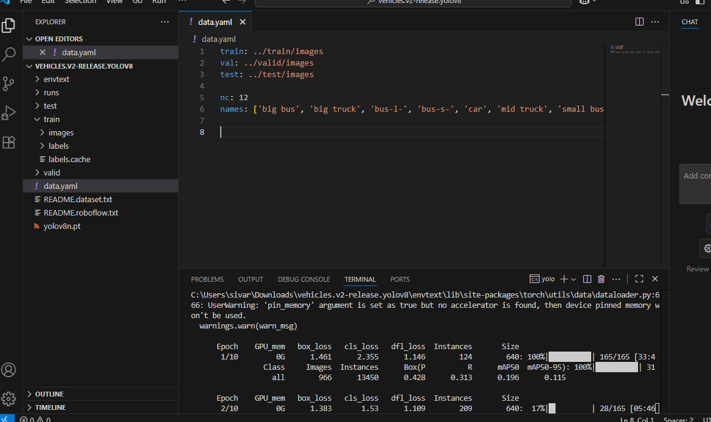
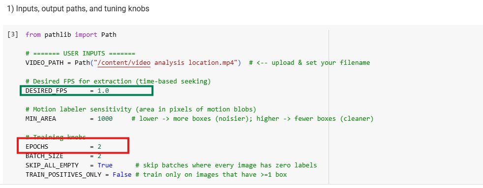
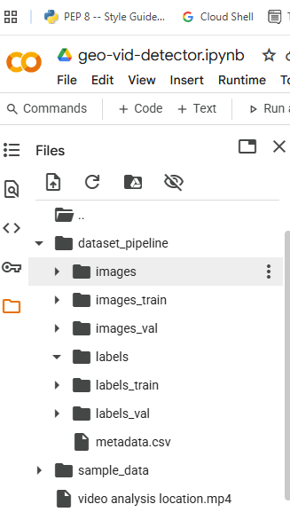
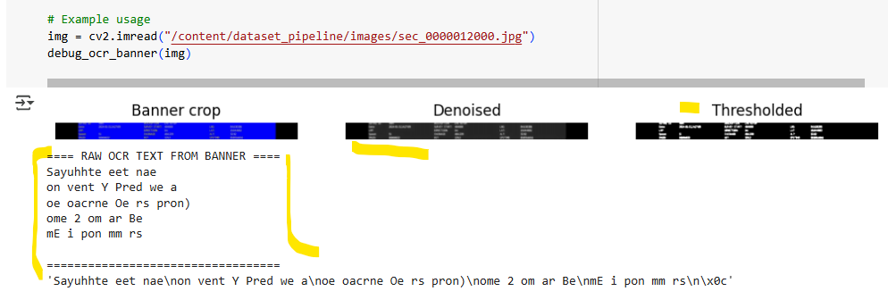

# video output Link: 
- original Video:  https://drive.google.com/file/d/1kcUaKQNXdkThDdXPb1t7n7entbr-QSRX/view?usp=sharing
- Output Video : https://drive.google.com/file/d/1K1XbDVAFvkFa0DfUllitElf2IaxKfTaj/view?usp=sharing

# Using 10 Epochs training custom Dataset creating a yolov .pt File to use

 

# Video-Detection-System
- You can change and give desired Fps rate  change the values as shown in the Image below.

 

## 📚 Dependencies

- Python 3.12+
- OpenCV (opencv-python
- Tesseract (pytesseract)
- PyTorch (torch, torchvision)
- Ultralytics (ultralytics)
- Others: pandas, tqdm, matplotlib, pillow

- 

This project extracts frames from a video at a configurable rate, performs **OCR (Optical Character Recognition)** using **Tesseract**, and applies **YOLOv8** object detection on the original video. Outputs include extracted frames, OCR metadata, and an annotated video with object detections.

---
## 📌 Notes
- Ensure your video is in a supported format (e.g., .mp4)
- OCR quality depends on video resolution and clarity
- Tesseract must be installed via apt for Colab environments
- YOLOv8 can run on CPU, but GPU is recommended for speed
- 
## 🚀 ## ⚙️ Features

- ✅ Extract frames at a fixed interval (e.g., every 0.5 seconds)
- ✅ Apply OCR using Tesseract on each frame
 
   - Tries **3 preprocessing routes**:  
     - Otsu threshold on grayscale  
     - Morphological open/close  
     - White-on-blue HSV mask + Otsu  
   - Extracts LAT/LON (if present) + saves raw OCR text.  
- ✅ Save OCR + timestamp info to a CSV file
- ✅ Perform YOLOv8 object detection on the full video
- ✅ Output annotated video with bounding boxes 
 

---
## 🗂️ Outputs
- `dataset_pipeline/frames/` – extracted JPG/PNG frames
- `dataset_pipeline/metadata.csv` – frame index, timestamp, OCR text, frame file path
- `output_annotated.mp4` – YOLO‑annotated video

---

## 🚀 Quick Start (Colab)

1. Open `object_detection_video.ipynb` in **Google Colab**.
2. Run **Setup** cell to install dependencies.
3. Upload your input video (or set the `VIDEO_PATH` / `INPUT_VIDEO` variable).
4. (Optional) For OCR on Windows, set the Tesseract path as shown above.
5. Run the **Frame Extraction + OCR** cell(s). This will populate the frames folder and write `metadata.csv`.
6. Run the **YOLO Inference** cell(s) to generate `output_annotated.mp4`.
    

---

## 🛠 Troubleshooting
- **OCR Issues**:  
  - Banner text may blur due to compression or motion.  
  - Use HSV mask route for better extraction of **white on blue**.
  - - 
  - Raw OCR is stored in `metadata.csv` for debugging.  

- **Motion Labels Mismatched**:  
  - Shadows or UI elements can be misclassified as motion.  
 

---

