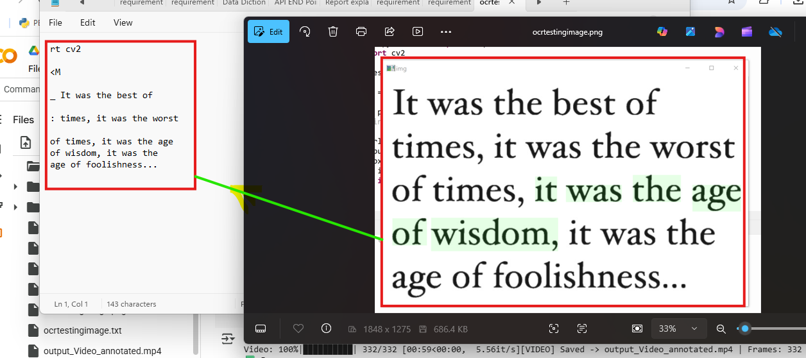

# video output Link: 
- original Video:  https://drive.google.com/file/d/1kcUaKQNXdkThDdXPb1t7n7entbr-QSRX/view?usp=sharing
- Output Video : https://drive.google.com/file/d/1K1XbDVAFvkFa0DfUllitElf2IaxKfTaj/view?usp=sharing
# Image output Detection using YOLO: 
**Image Datection Before and After:**
  
 
 

   
# Train a YOLOv8 model using Ultralytics on a custom dataset for 10 epochs,

 

# Using OCR Extract text From Image

# Video-Detection-System
- You can change and give desired Fps rate  change the values as shown in the Image below.

 
# 🎥 Object Detection on Video + 🧾 OCR Frame Extraction (YOLOv8, OpenCV, Tesseract)

This project is a **Colab-first** (also works locally) notebook that:

- Extracts frames from a video at a desired FPS
- Runs **OCR** (Tesseract) on each extracted frame and logs results to a CSV
- Performs **object detection** on **images** and **videos** using **YOLOv8 (Ultralytics)**
- Saves annotated outputs (images/video) and a metadata CSV

 ## ✨ Features

- **Frame Extraction @ custom FPS** → Saves frames to `/content/dataset_pipeline/images`
- **OCR via Tesseract** → Extracted text per frame saved to `metadata.csv`
- **YOLOv8 Inference**
  - Image inference → saves `annotated_detected_image.jpg`
  - Video inference → saves `output_Video_annotated.mp4`
- **Colab convenience** → One-click installs for `tesseract-ocr` and required Python packages  
- **Local support** → Works on Windows/macOS/Linux (with minor path tweaks)

  
## 📚 Dependencies
The notebook installs everything automatically:
- `tesseract-ocr`
- `opencv-python`, `pillow`, `pytesseract`
- `torch`, `torchvision`
- `matplotlib`, `pandas`, `tqdm`
- `ultralytics` (YOLOv8)
- Python 3.12+

---
## 📌 Notes
- Ensure your video is in a supported format (e.g., .mp4)
- OCR quality depends on video resolution and clarity
- Tesseract must be installed via apt for Colab environments
- YOLOv8 can run on CPU, but GPU is recommended for speed
 

---
## 🗂️ Outputs
- `dataset_pipeline/frames/` – extracted JPG/PNG frames
- `dataset_pipeline/metadata.csv` – frame index, timestamp, OCR text, frame file path
- `output_annotated.mp4` – YOLO‑annotated video

---

## 🚀 Quick Start (Colab)

1. Open `object_detection_video.ipynb` in **Google Colab**.
2. Run **Setup** cell to install dependencies.
3. Upload your input video (or set the `VIDEO_PATH` / `INPUT_VIDEO` variable).
4. (Optional) For OCR on Windows, set the Tesseract path as shown above.
5. Run the **Frame Extraction + OCR** cell(s). This will populate the frames folder and write `metadata.csv`.
6. Run the **YOLO Inference** cell(s) to generate `output_annotated.mp4`.
    

---

## 🛠 Troubleshooting
- **OCR Issues**:  
  - Banner text may blur due to compression or motion.  
  - Use HSV mask route for better extraction of **white on blue**.
  - - 
  - Raw OCR is stored in `metadata.csv` for debugging.  

- **Motion Labels Mismatched**:  
  - Shadows or UI elements can be misclassified as motion.  
 

---

